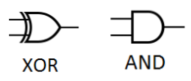
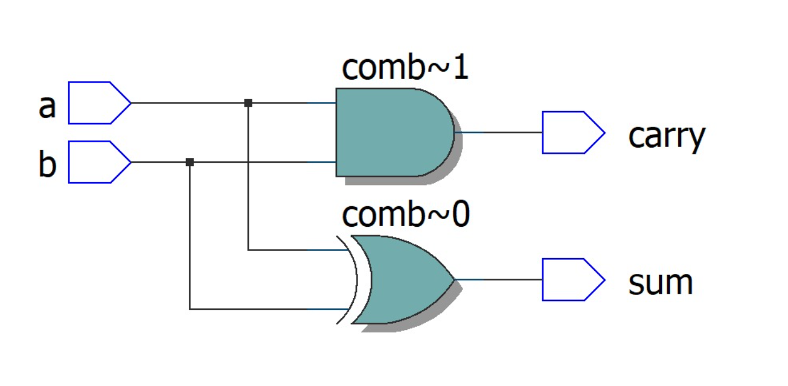
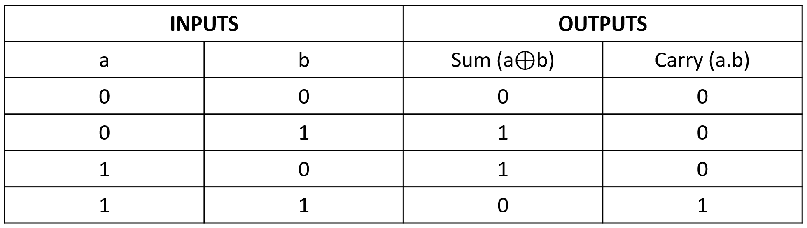
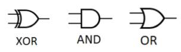
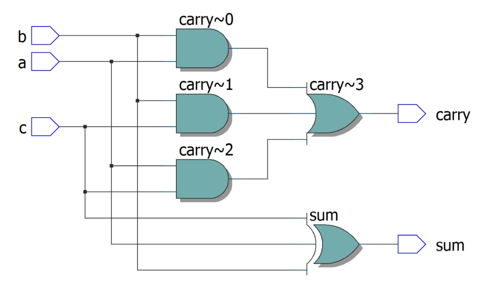
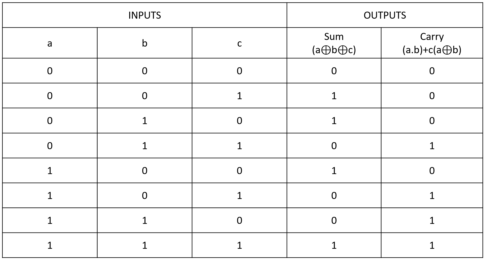

# Exp-02-Implementation-of-Half-Adder-and-Full-Adder-Circuit

# Implementation-of-Half-Adder-and-Full-Adder-circuit
## AIM:
To design a half adder and full adder circuit and verify its truth table in Quartus using Verilog programming.

## EQUIPMENT'S REQUIRED:
Hardware – PCs, Cyclone II , USB flasher
Software – Quartus prime

## THEORY:
Adders are digital circuits that carry out addition of numbers.


### Half Adder:
Half adder is a combinational circuit that performs simple addition of two binary numbers. The input variables designate the augend and addend bits; the output variables produce the sum and carry. It is necessary to specify two output variables because the result may consist of two binary digits.

Sum = A’B+AB’ =A ⊕ B Carry = AB

### Full Adder:
Full adder is a digital circuit used to calculate the sum of three binary bits. It consists of three inputs and two outputs. Two of the input variables, denoted by A and B, represent the two significant bits to be added. The third input, Cin, represents the carry from the previous lower significant position. Two outputs are necessary because the arithmetic sum of three binary digits ranges in value from 0 to 3, and binary 2 or 3 needs two digits. The two outputs are sum and carry.

Sum =A’B’Cin + A’BCin’ + ABCin + AB’Cin’ = A ⊕ B ⊕ Cin Carry = AB + ACin + BCin

 

#### Figure -01 HALF ADDER 


#### Figure -02 FULL ADDER 

## PROCEDURE:

1. Connect the supply (+5V) to the circuit
2. Switch ON the main switch
3. If the output is 1, then the led glows.

## PROGRAM:
```
Program to design a half adder and full adder circuit and verify its truth table in quartus using Verilog programming.
Developed by: Aashima Nazreen Sayeed S
RegisterNumber: 212221240002
```

```
HALF ADDER

module Adder(a,b,sum,carry);
input a,b;
output sum,carry;
xor(sum,a,b);
and(carry,a,b);
endmodule 
```
```
FULL ADDER

module FullAdder(a,b,c,sum,carry);
input a,b,c;
output sum,carry;
assign sum = ((a^b)^c);
assign carry = ((a&b)|(b&c)|(c&a));
endmodule
```

## OUTPUT:
## Half Adder : 
### Logic Symbol:

<br> 

### RTL Realization:

<br>

### Truthtable:

<br>

### Timing Diagram:


<br>


## Full Adder : 
### Logic Symbol:

<br>

### RTL Realization:

<br>

### Truthtable:

<br>

### Timing Diagram:


<br>

## RESULT:
Thus, a half adder and full adder circuit is designed to verify its truth table in Quartus using Verilog programming.
